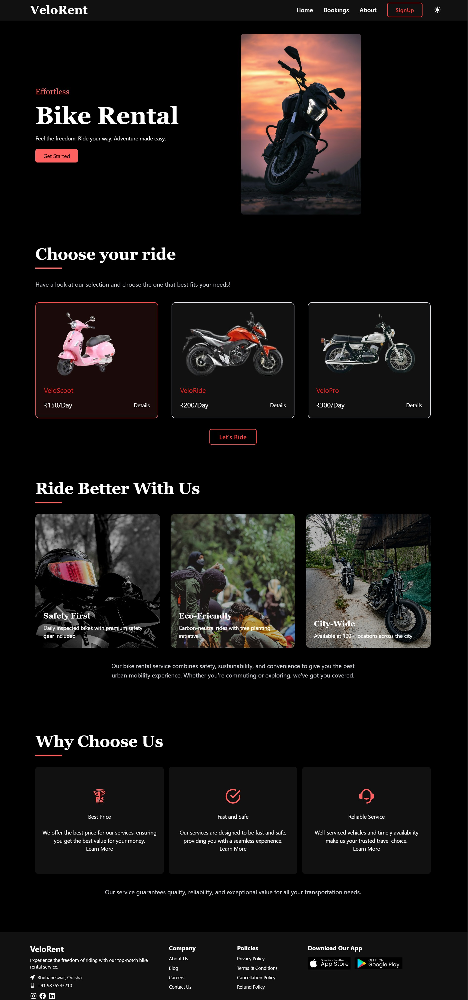
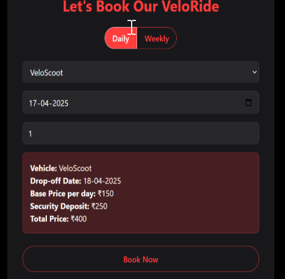
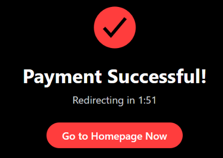

# VeloRent Bike Rental

A responsive bike rental platform with ride selection and promotional sections.

## Full Page Preview


<div style="display: flex; justify-content: center; gap: 15px; margin-top: 20px;">
  
  
</div>

## Setup
1. Clone repo:
   ```bash
   git clone https://github.com/rithikargb/velorent-bike-rental.git
   ```
2. Install dependencies:
   ```bash
   npm install
   ```
3. Run locally:
   ```bash
   npm run dev
   ```

## My Work
- Built entire frontend UI
- Implemented responsive layouts
- Added interactive elements
